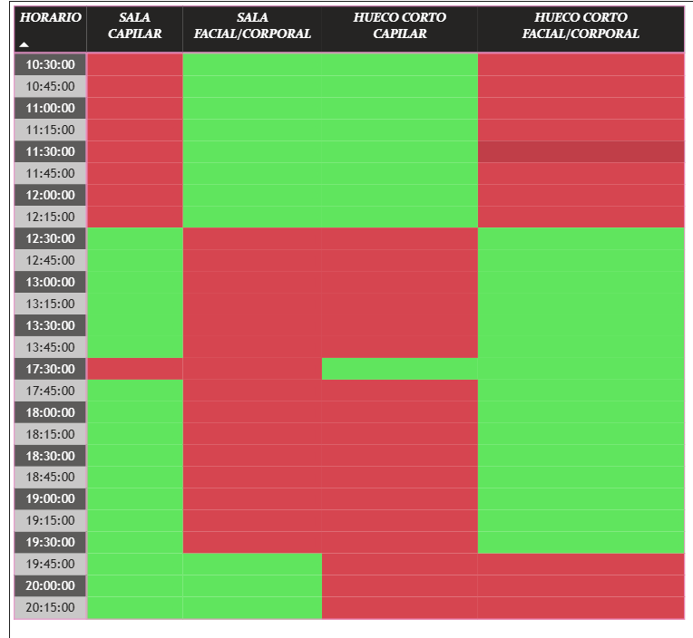

# BBI Spa Analytics  
**Real-world Business Intelligence case study**

---

## Project overview
This project presents a real-world business intelligence case developed under **Ben&Co Business Intelligence (BBI)** for a small spa centre.  
The objective was to analyse agenda usage, capacity distribution and operational bottlenecks in order to support data-driven decision making.

The project focuses on transforming raw booking data into **actionable insights** that can directly impact operational efficiency, revenue potential and service planning.

---

## Business context
The client operates a spa centre offering multiple treatments with different durations, room requirements and staff dependencies.  
Despite a high level of activity, the business lacked a clear understanding of:

- How capacity was actually being used throughout the day
- Which time slots were over- or under-utilised
- Where operational constraints were limiting growth

Decisions were being made primarily based on intuition rather than structured data analysis.

---

## Problem statement
The main challenges addressed in this project were:

- Lack of visibility over real capacity usage
- Inefficient distribution of appointments across time slots
- Hidden bottlenecks caused by room availability and service duration
- Difficulty identifying realistic opportunities for optimisation

The goal was to convert booking data into a clear analytical framework to support operational decisions.

---

## Analytical approach
The analysis followed a structured BI workflow:

1. **Data preparation**
   - Cleaning and standardisation of booking records
   - Time slot normalisation
   - Service duration alignment
   - Capacity constraints modelling

2. **Data modelling**
   - Logical separation of services, time slots and capacity units
   - Preparation of a model suitable for analytical querying

3. **Visual analytics**
   - Time-based occupancy analysis
   - Capacity usage by hour and service type
   - Identification of peak periods and idle capacity

4. **Insight generation**
   - Detection of structural inefficiencies
   - Identification of realistic optimisation opportunities

---

## Key insights
Some of the most relevant insights obtained include:

- Certain peak hours reached capacity saturation while adjacent slots remained underutilised
- Specific services acted as bottlenecks due to duration and room dependency
- A redistribution of appointments could improve overall utilisation without increasing resources
- Capacity limitations were operational rather than demand-driven in several cases

These findings challenged initial assumptions held by the business.

---

## Visual outputs
The analysis was delivered through an interactive dashboard designed for non-technical stakeholders, including:

- Global agenda overview
- Capacity usage by time slot
- Bottleneck identification
- Comparative service analysis
### Dashboard overview

This view provides a high-level picture of the agenda structure, overall occupancy and operational balance across the day.

---

### Capacity usage by hour

This chart highlights demand concentration by time slot, clearly showing peak periods and underutilised hours across different service categories.

---

### Operational bottlenecks

The heatmap representation makes structural bottlenecks visible, revealing how certain services and time slots constrain the overall system.

---

### Underutilised capacity

This view exposes optimisation opportunities where capacity remains available adjacent to saturated periods, enabling actionable scheduling improvements.

> All visuals shared in this repository are anonymised and representative of the original analysis.

---

## Recommendations
Based on the analysis, several data-driven recommendations were proposed:

- Adjust appointment distribution across time slots
- Redesign service scheduling to reduce bottlenecks
- Focus marketing efforts on underutilised periods
- Use capacity-aware planning for future service expansion

These recommendations are directly actionable and aligned with the operational reality of the business.

---

## Tools & technologies
- Power BI (data modelling, DAX measures, dashboards)
- Data cleaning and transformation techniques
- Analytical thinking applied to real business constraints

---

## Next steps
Possible extensions of this project include:

- Revenue impact simulation
- Demand forecasting by service type
- What-if analysis for capacity expansion
- Automation of reporting workflows

---

## About Ben&Co Business Intelligence
**Ben&Co Business Intelligence (BBI)** provides data analysis and visualisation services focused on turning data into practical business decisions for small and medium-sized organisations.

This project represents a real example of applied business intelligence in a professional context.
